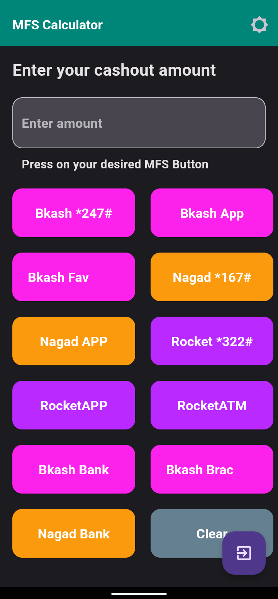
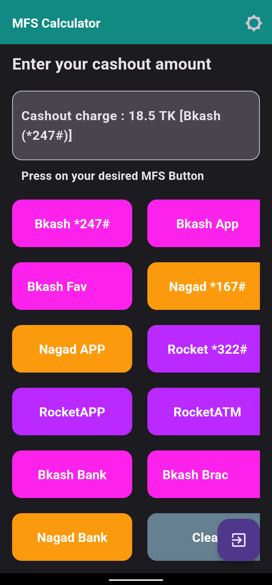

# MFS-Calculator (APK)

The MFS-Calculator is a mobile app designed for calculating financial service charges in Bangladesh. With this app, you can easily calculate the cash-out charges for all major Bangladeshi MFS providers, including bKash, Nagad, and Rocket, all in one place.

### Note:

- This app is exclusively for Bangladeshi MFS charge calculations.   
- The app supports Android devices running version 4.0 or higher.   

  

 

### Download the app

### Web Version

  
### For any query :

